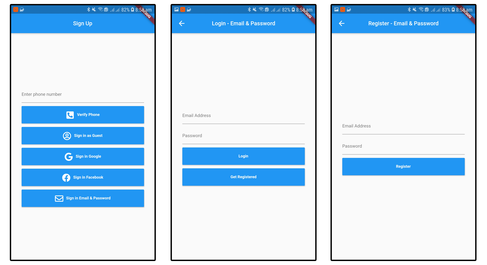
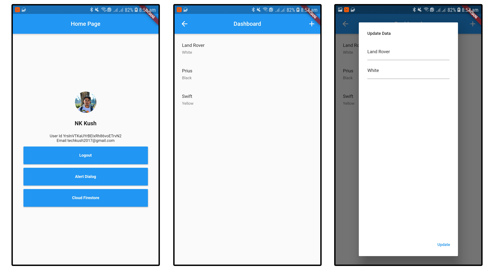

# Flutter Authentication Bundle with Firebase

1. Phone, Guest, Google, Facebook, Email & Password Authentication Done.
2. Get data from firebase for showing profile Name, Id, PhotoURL, Phone number, and Email address.
3. Firestore CRUD

Authentication Part

Profile and CRUD Example

